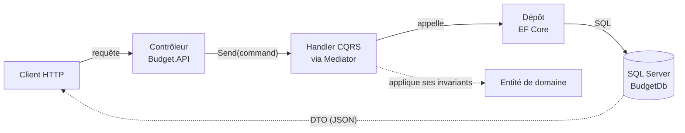
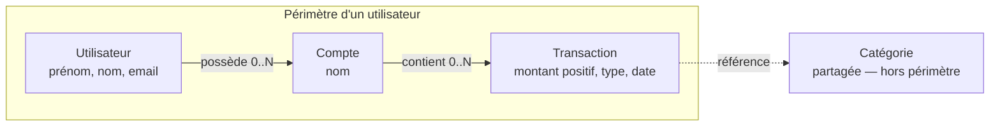

# Bulget — Comprendre le projet

Une API de gestion budgétaire personnelle : comptes, transactions et bilan mensuel, pensée pour être expliquée aussi bien à un développeur qu'à quelqu'un du métier.

`.NET 10 · ASP.NET Core` · `Clean Architecture` · `CQRS (Mediator)` · `EF Core · SQL Server` · `JWT`

## Sommaire

1. [En bref](#01--en-bref)
2. [Parcours utilisateur](#02--le-parcours-du-compte-créé-au-bilan-consulté)
3. [Règles métier](#03--les-règles-métier)
4. [Architecture](#04--architecture--clean-architecture--cqrs)
5. [Modèle de domaine](#05--modèle-de-domaine)
6. [Endpoints](#06--les-endpoints)
7. [Pile technique](#07--pile-technique)
8. [État actuel](#08--état-actuel-du-projet)

---

## 01 — En bref

Bulget permet à un utilisateur de suivre son argent : il ouvre un ou plusieurs comptes, y enregistre ses revenus et ses dépenses, et consulte à tout moment le bilan de son mois — combien est entré, combien est sorti, ce qu'il reste.

Techniquement, c'est une API REST en .NET, structurée selon les principes de la *Clean Architecture* : chaque couche a une seule responsabilité, et le cœur métier (les règles de calcul, les invariants) ne dépend d'aucun détail technique — ni de la base de données, ni du framework web. C'est ce qui permet au projet de rester compréhensible et testable en grandissant.

## 02 — Le parcours, du compte créé au bilan consulté

Cinq étapes, dans l'ordre où un utilisateur les vit réellement :

1. **Inscription** — Prénom, nom, email, mot de passe (avec confirmation) et acceptation des conditions.
   `POST /api/auth/register`

2. **Connexion** — Email + mot de passe, avec une option « se souvenir de moi » qui prolonge la session.
   `POST /api/auth/login`

3. **Création d'un ou plusieurs comptes** — Un compte représente une poche d'argent : compte courant, livret, espèces.
   `POST /api/accounts`

4. **Enregistrement des transactions** — Chaque revenu ou dépense est rattaché à un compte et, en général, à une catégorie (« Salaire », « Courses »…).
   `POST /api/transactions`

5. **Consultation du bilan mensuel** — Total des revenus, total des dépenses et solde, agrégés sur tous les comptes de l'utilisateur pour un mois donné.
   `GET /api/dashboard/monthly`

## 03 — Les règles métier

Ce ne sont pas des détails d'implémentation : ce sont les décisions qui définissent ce que Bulget autorise ou interdit, et qui sont vérifiées au niveau du domaine, pas seulement de l'API.

**Domaine**

- **Un montant est toujours positif.** Le signe ne vient jamais du chiffre saisi mais du type de la transaction (revenu ou dépense). Une dépense de 50 € est stockée comme 50, jamais −50.
- **Un compte et ses transactions n'appartiennent qu'à un utilisateur.** Cette isolation est vérifiée à chaque appel : personne ne peut voir ou modifier les comptes d'un autre.
- **Les catégories sont partagées, pas personnelles.** Contrairement aux comptes, une catégorie n'a pas de propriétaire : tout utilisateur connecté peut créer, renommer ou supprimer une catégorie du catalogue commun.
- **Le type et le compte d'une transaction sont figés.** Après création, on peut corriger le montant, la description, la catégorie ou la date — jamais transformer une dépense en revenu ni la déplacer vers un autre compte.

**Sécurité**

- **Mot de passe : une exigence en quatre points.** Huit caractères minimum, une majuscule, une minuscule, un chiffre, un caractère spécial — et confirmation identique exigée à l'inscription.
- **Le mot de passe en clair n'est jamais stocké.** Seule son empreinte (hash) est conservée en base ; elle ne permet pas de retrouver le mot de passe d'origine.

## 04 — Architecture : Clean Architecture + CQRS

Le code est organisé en couches concentriques. Les couches externes (API, persistance) dépendent des couches internes (domaine, cas d'usage) — jamais l'inverse. C'est ce qui permet de changer de base de données ou de framework web sans toucher aux règles métier.

| Couche | Rôle |
|---|---|
| `Budget.Domain` | Le cœur : entités métier (Utilisateur, Compte, Catégorie, Transaction) et leurs règles. Ne dépend de rien d'autre. |
| `Budget.Application` | Les cas d'usage (commandes/requêtes) organisés par fonctionnalité : Authentication, Comptes, Categories, Transactions, Bilans. |
| `Budget.Application.Contrats` | Les interfaces attendues par les cas d'usage (dépôts de données, hachage de mot de passe, service de jeton). |
| `Budget.Application.Adapters` | Les implémentations de ces interfaces qui ne touchent pas à la base de données (génération du JWT, hachage). |
| `Budget.Application.Dtos` | Les formes de données échangées avec l'extérieur (requêtes et réponses de l'API). |
| `Budget.Infrastructure.Persistence` | Entity Framework Core : contexte de base de données, mapping des entités, dépôts, migrations. |
| `Budget.Infrastructure.Exceptions` | Exceptions partagées (NotFound, Forbidden, Conflict) traduites en codes HTTP. |
| `Budget.API` | Contrôleurs, authentification JWT, gestion globale des erreurs, documentation OpenAPI. |

### Le trajet d'une requête

Le contrôleur ne contient aucune logique : il traduit la requête HTTP en commande, l'envoie au médiateur, et renvoie ce que le handler retourne. Toute la logique — y compris les vérifications d'appartenance — vit dans le handler et l'entité de domaine qu'il manipule.

### Autorisation : deux niveaux

Un premier niveau, générique, vérifie côté API que la requête porte un jeton JWT valide. Un second niveau, propre à chaque cas d'usage, vérifie que la ressource demandée appartient bien à l'utilisateur connecté (par exemple via `CompteAuthorizationGuard`) — ce choix délibéré évite de mélanger « qui peut appeler l'API » et « qui possède quoi ».

## 05 — Modèle de domaine

Quatre entités suffisent à représenter tout le métier. La particularité à retenir : les **catégories** sont les seules à ne pas appartenir à un utilisateur.

Les catégories sont hors de la frontière du périmètre utilisateur : c'est la seule entité qui n'a pas de propriétaire. Une transaction, elle, ne peut exister sans compte, et un compte ne peut exister sans utilisateur.

## 06 — Les endpoints

Cinq contrôleurs. Tous exigent un jeton JWT valide, à l'exception de l'authentification.

| Route | Action |
|---|---|
| `POST /api/auth/register` | Inscription (prénom, nom, email, mot de passe + confirmation, acceptation des CGU) |
| `POST /api/auth/login` | Connexion, avec option « se souvenir de moi » |
| `GET /api/accounts` | Liste des comptes de l'utilisateur connecté |
| `POST /api/accounts` | Créer un compte |
| `PUT /api/accounts/{id}` | Renommer un compte |
| `DELETE /api/accounts/{id}` | Supprimer un compte |
| `GET /api/categories` | Liste des catégories (catalogue partagé) |
| `POST /api/categories` | Créer une catégorie |
| `PUT /api/categories/{id}` | Renommer une catégorie |
| `DELETE /api/categories/{id}` | Supprimer une catégorie |
| `GET /api/transactions?compteId=` | Historique des transactions d'un compte |
| `POST /api/transactions` | Enregistrer un revenu ou une dépense |
| `PUT /api/transactions/{id}` | Modifier montant, description, catégorie ou date |
| `DELETE /api/transactions/{id}` | Supprimer une transaction |
| `GET /api/dashboard/monthly?annee=&mois=` | Bilan mensuel : revenus, dépenses, solde |

## 07 — Pile technique

| Rôle | Choix |
|---|---|
| Framework | ASP.NET Core (.NET 10) |
| CQRS / médiateur | Mediator (générateur de code, sans réflexion) |
| Accès aux données | Entity Framework Core → SQL Server |
| Authentification | JWT Bearer |
| Documentation API | OpenAPI + Swagger UI (dev) |
| Tests | xUnit (scaffoldé, non rempli) |

## 08 — État actuel du projet

Le projet est jeune — utile à savoir avant de le présenter à quelqu'un qui s'attendrait à un produit mature.

- **Historique très récent.** Les trois migrations de base de données sont toutes datées du même jour : le schéma est encore en train de se stabiliser.
- ⚠️ **Aucun test automatisé réel.** Le projet de tests existe mais ne contient que le test vide généré par défaut — les règles métier (montant positif, isolation par utilisateur…) ne sont pas encore vérifiées automatiquement.
- ⚠️ **Catégories globales : choix ou lacune ?** Toute personne connectée peut créer, renommer ou supprimer n'importe quelle catégorie du catalogue commun. À confirmer si c'est la cible produit ou une étape intermédiaire avant des catégories personnelles.
- **Nom du dépôt vs version réelle.** Le dépôt s'appelle « Bulget.API.Net8 » mais tous les projets ciblent .NET 10 — un simple écart de nommage à corriger pour éviter la confusion.
